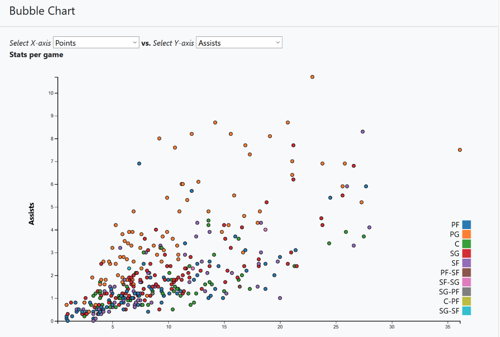
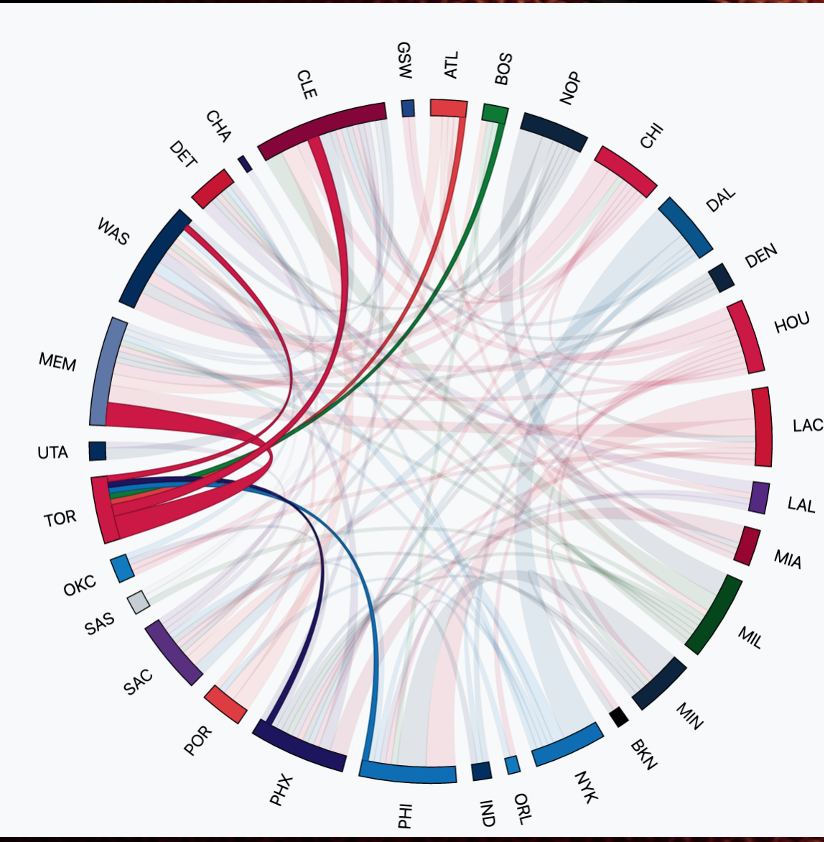
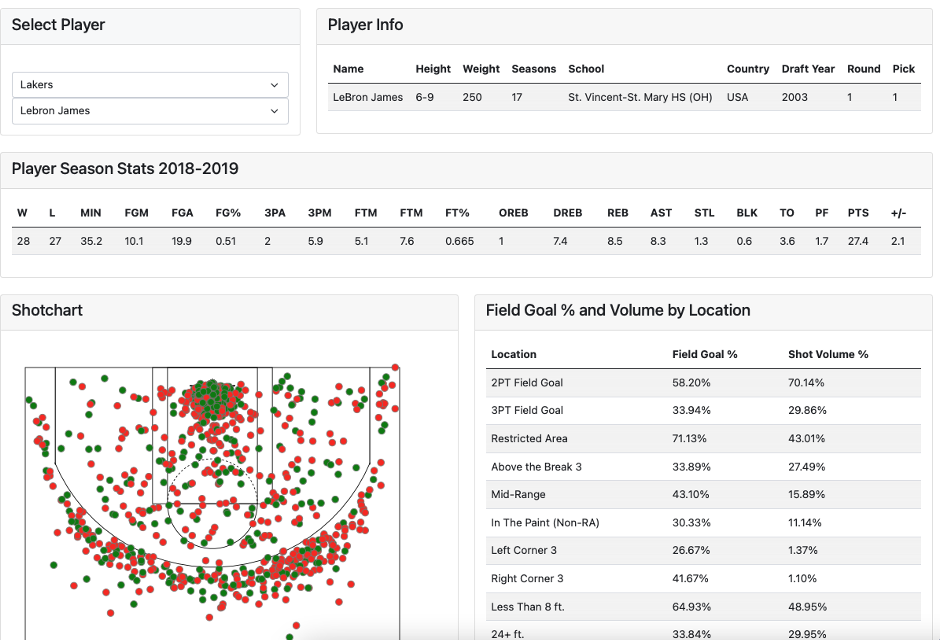

# NBA2019

# NBA 2018-2019

## Table of Contents
* [Description](#description)
* [Task](#Your-Task)
* [Preview](#preview)

## Description
Our group plans to look at the relationship between players in the NBA 2018-2019 and their statistics.We will look into players salary, statistic X, age and
advanced stats.
The goal is to develop a robust database from multiple sources including: sports-reference API, NBA.com, Data.world. Due to the overlap in our datasets, the best
season for evaluation is 2018-2019 season.
Link to dataset: Script with load to a postgresSQL heroku database

## Your-Task
My group decided to create 3 visualizations for this project:
1. Chord chart- This chart showed trades between teams during the 2018-2019 seasos. You can hover over a team and the chord will connect with the team it traded with. The width of the chord indicated the number of players involved. ie. wider= more players involved 
2. Interactive Bubble chart - User is able to select stats from dropdown menu and the chart will update to the selected stats. It compared selected stat categories for all the players that played during the season. Each dot is a different player and can be hovered over for additional information.
3. Player shot chart - User can select the player to see their player info, season stats, shot chart and Game log for the player

## Preview
Bubble chart

Chord chart

Shot chart

Group members: Jeremy Kardash, Aaron Spivak, Matt Davies, Jasper Parson 
## Link to App
 https://nba2018-2019.herokuapp.com/
## More Info
Github: https://github.com/aspivak5

Email: aaron.spivak5@gmail.com
